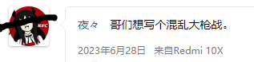

而且得是局域网联机的，因为哥们想玩

# 安装

先装依赖：Window -> Package Manager -> Input System
再装Mirror：https://assetstore.unity.com/packages/tools/network/mirror-129321 导入路径：/P1项目文件夹/Assets/

激活Input System：Edit > Project Settings > Player > Active Input Handling